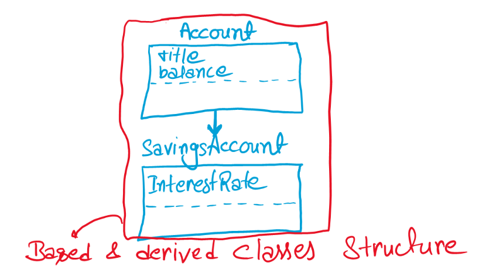
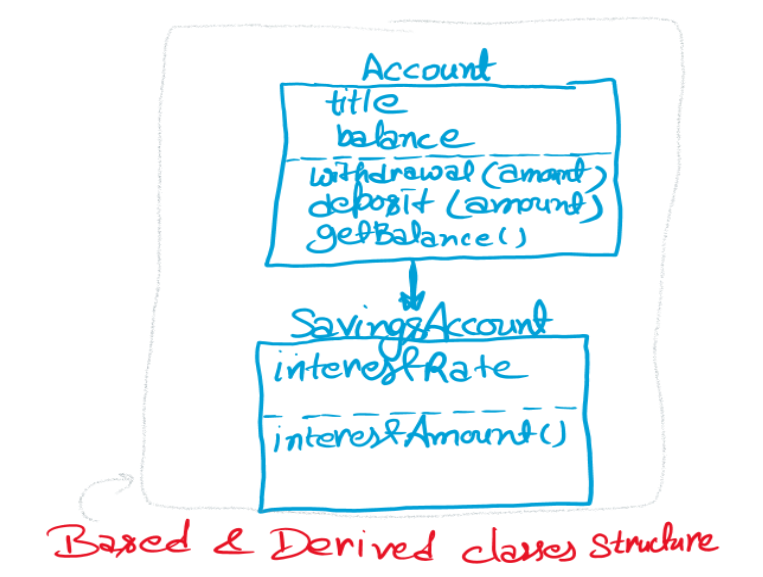

# OOP Assignment

## Challenge 1: Square Numbers and Return Their Sum

🔴 In this challenge, you need to implement a method that squares passing variables and returns their sum.

**Problem statement**:
Implement a class `Point` that has three properties and a method. All these attributes (properties and methods) should be `public`. This problem can be broken down into two tasks:

*Task 1*:
👉 Implement a constructor to initialize the values of three properties: x, y, and z.

*Task 2*:
👉 Implement a method, `sqSum()`, in the `Point` class which squares `x`, `y`, and `z` and returns their sum.

Sample properties
    `1`, `3`, `5`

Sample method output
    `35`

**Coding exercise**
Create a class `Point` with three properties: `x`, `y`, and `z`.

    class Point:

        def __init__(self):
            self.x = x
            self.y = y
            self.z = z

        def sqSum(self):
            pass

## Challenge 2: Implement a Calculator Class

🔴 In this exercise, you have to implement a calculator that can perform addition, subtraction, multiplication, and division.

**Problem statement**
Write a Python class called Calculator by completing the tasks below:

*Task 1*

👉 **Initializer**

Implement an initializer to initialize the values of num1 and num2.
Properties

    • `num1`
    • `num2`

*Task 2*

👉 **Methods**

    • `add()` is a method that returns the sum of num1 and num2.
    • `subtract()` is a method that returns the subtraction of num1 from num2.
    • `multiply()` is a method that returns the product of num1 and num2.
    • `divide()` is a method that returns the division of num2 by num1.

Input
    - Pass numbers (integers or floats) in the initializer.

Output
    - addition, subtraction, division, and multiplication

Sample input

    obj = Calculator(10, 94)
    obj.add()
    obj.subtract()
    obj.multiply()
    obj.divide()

Sample output

    104
    84
    940
    9.4

Coding exercise

    class Calculator:

        def __init__(self):
            pass
        def add(self):
            pass
        def subtract(self):
            pass
        def multiply(self):
            pass
        def divide(self):
            pass

## Challenge 3: Implement the Complete Student Class

    🔴In this challenge, you will implement a student class

**Problem statement**

Implement the complete **Student** class by completing the tasks below

*Task*

👉 Implement the following properties as **`private`**:

    • name
    • rollNumber

👉 Include the following methods to get and set the **`private properties`** above:

    • getName()
    • setName()
    • getRollNumber()
    • setRollNumber()

👉 Implement this class according to the rules of encapsulation.

Input
    - Checking all the properties and methods

Output
    - Expecting perfectly defined fields and getter/setters

***`Note:` Do not use initializers to initialize the properties. Use the set methods to do so.***

If the setter is not defined properly, the corresponding getter will also generate an error even if the getter is defined properly.

Coding exercise

    class Student:

        def setName(self):
            pass
        def getName(self):
            pass
        def setRollNumber(self):
            pass
        def getRollNumber(self):
            pass

## Challenge 4: Implement a Banking Account

    🔴 In this challenge, you will implement a banking account using the concepts of inheritance.

**Problem statement**

Implement the basic structure of a parent class, `Account`, and a child class, `SavingsAccount`.

*Task 1*

👉  Implement properties as `instance variables`, and set them to `None` or `0`.

`Account` has the following properties:

        • title
        • Balance

`SavingsAccount` has the following properties:

        • interestRate

*Task 2*

Create an `initializer` for Account class. The order of parameters should be the following, where `Ashish` is the `title`, and `5000` is the `account balance`:

**Account("Ashish", 5000)**

*Task 3*

Implement properties as **instance variables**, and set them to `None` or `0`.

Create an `initializer` for the `SavingsAccount` class using the initializer of the `Account` class in the order below:

**Account("Ashish", 5000, 5)**

Here, `Ashish`  is the `title` and `5000` is the `balance` and `5` is the `interestRate`.

Coding exercise

    class Account:

        def __init__(self):
            # write your code here
            pass

    class SavingsAccount():

        def __init__(self):
            # write your code here
            Pass

## Challenge 5: Handling a Bank Account

🔴 In this challenge, you will define methods for handling a bank account using concepts of `inheritance`.

**Problem statement**

In this challenge, we will be extending the previous challenge and implementing methods in the parent class and its corresponding child class.

The initializers for both classes have been defined for you.

*Task 1*

In the `Account` class, implement the `getBalance()` method that returns `balance`.

*Task 2*

In the `Account` class, implement the `deposit(amount)` method that adds `amount` to the `balance`.

It **does not** return anything.

Sample input

    balance = 2000
    deposit(500)
    getbalance()

Sample output

    2500

*Task 3*

In the `Account` class, implement the `withdrawal(amount)` method that subtracts the `amount` from the `balance`.

It **does not** return anything.

Sample input

    balance = 2000
    withdrawal(500)
    getbalance()

Sample output

    1500

*Task 4*

In the `SavingsAccount` class, implement an `interestAmount()` *method* that **returns** the interest amount of the **current balance**. 

**Below is the formula for calculating the interest amount:**

Sample input

    balance = 2000
    interestRate = 5
    interestAmount()

Sample output

    100

`The following figure shows what the result should logically look like:`

Coding exercise

***`Note:` A new `SavingsClass` object is initialized at the end of the code and test results will be based on it.***

    class Account:
        def __init__(self, title=None, balance=0):
            self.title = title
            self.balance = balance
        
        def withdrawal(self, amount):
            # write code here
            pass

        def deposit(self, amount):
            # write code here
            pass
        def getBalance(self):
            # write code here
            pass

    class SavingsAccount(Account):
        def __init__(self, title=None, balance=0, interestRate=0):
                super().__init__(title, balance)
                self.interestRate = interestRate
        
        def interestAmount(self):
            # write code here
            pass

    #code to test - do not edit this

    demo1 = SavingsAccount("Ashish", 2000, 5)   # initializing a SavingsAccount object

