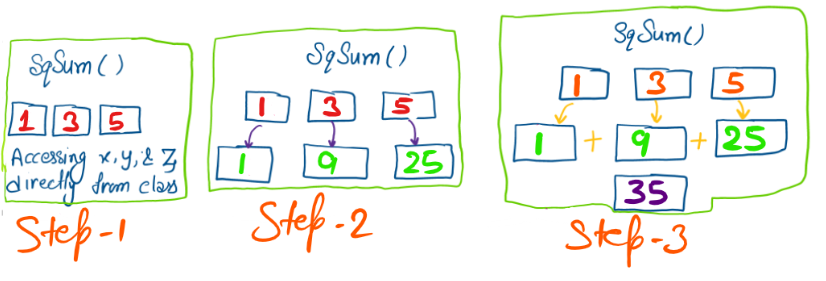

# OOP Assignment

## Challenge 1: Square Numbers and Return Their Sum

In this challenge, you need to implement a method that squares passing variables and returns their sum.

**Problem statement**:

Implement a class `Point` that has three properties and a method. All these attributes (properties and methods) should be `public`. This problem can be broken down into two tasks:

*Task 1*
Implement a constructor to initialize the values of three properties: x, y, and z.

*Task 2*
Implement a method, `sqSum()`, in the `Point` class which squares `x`, `y`, and `z` and returns their sum.

Sample properties
    `1`, `3`, `5`

Sample method output
    `35`

**Coding exercise**
Create a class `Point` with three properties: `x`, `y`, and `z`.

class Point:
    def __init__(self):
        self.x = x
        self.y = y
        self.z = z
    def sqSum(self):
        pass

